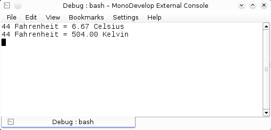

# Expresiones lambda (lambda expressions) en C#
 

La programación imperativa es uno de los paradigmas de computación mas ampliamente utilizados por la mayoría de lenguajes de programación de alto nivel debido al gran soporte académico y comercial y a que los programas son relativamente independientes del tipo de computadora donde se ejecutan porque los lenguajes de programación deben abstraer las operaciones del modelo de maquina para la cual se diseñaron.

La programación imperativa se basa en el modelo de la máquina de Von Neuman, del cual la mayoría de las computadoras personales y estaciones de trabajo tienen elementos comunes.

Aunque menos utilizado existe otro paradigma que a diferencia del imperativo se basa en las matemáticas (aplicación de funciones) con el cual igualmente podemos expresar operaciones computacionales de forma mas compacta y abstracta, este paradigma se conoce como programación funcional.

Uno de los muchos elementos del paradigma funcional que .NET incluye desde la versión 3.0 son las expresiones lambda (lambda expression).

<h3>Programación Funcional</h3>

Los conceptos básicos de la programación funcional datan de 1956 a 1958 con el trabajo de Jonh McCarthy en el desarrollo y diseno de LISP (List Processor), este lenguaje esta basado en el calculo lambda que sento las bases de los lenguajes funcionales, características como:

<ul>
    <li><b>Recursión:</b> se utiliza para para realizar operaciones repetitivas, no utiliza la iteración.</li>
    <li><b>Funciones de primer orden:</b> las funciones tienen el mismo nivel que cualquier otro elemento del lenguaje,pueden aplicarse a valores, evaluarse, regresar un valor y ser parámetros de otras funciones.
        <li><b>No requiere asignación:</b> el computo se realiza aplicando funciones a los argumentos.</li>
        <li><b>Garbage collector:</b> Se reclaman los objetos que no están siendo utilizado por el programa.</li>
        <li><b>Tipado dinámico (Dynamic typing):</b> La comprobación del tipo se realiza en tiempo de ejecución, los valores tienen tipos, pero las variables no.</li>
</ul>

El paradigma funcional se basa en el concepto matemático de función, que la mayoria de los lenguajes de programación imperativos y funcionales comparten y cuya definición es

<blockquote><i>(1)Una función f es una regla que asigna a cada elemento x de un conjunto A exactamente un elemento llamado f(x) de conjunto B</i></blockquote>

Donde la programación funcional marca su diferencia con la imperativa es que para la programación funcional cada programa es equivalente a esta definición, donde x es el argumento o dominio de f mientras que y es el rango de f o la salida sea los programas son cajas negras donde solo importa el que se esta computando y no el como se esta computando que es el caso de la programación imperativa.

En resumen cuando se programa de forma funcional se piensa más en expresiones y su significado que en una secuencia de operaciones en memoria.

<h3>Tipos Delegate y métodos anónimos</h3>

Desde sus primeras versiones .NET introdujo el objeto <b>delegate (delegado)</b> que es un tipo particular de objeto (un delegate deriva de la clase base System.Delegate), que puede encapsular la referencia a un método estático o de una instancia como si fuera un mecanismo de callback(devolución de llamada) similar a los apuntadores de función de C y C++ pero con la importante diferencia de que proporciona un tipado seguro (type-safety) para evitar errores en tiempo de ejecución y que puedan detectarse en tiempo de compilación si la función no coincide con la firma del método al que hace referencia.

Esto posibilita en un contexto de programación orientada a objetos que los métodos pueden recibir como argumentos otros métodos además de tipos primitivos y de referencia. Veamos un ejemplo para ilustrar estos conceptos con C#.

En versiones anteriores a C# 2.0 (1.1,1.0) los delegate se utilizaban como parámetros, veamos el siguiente ejemplo que se compone de dos clases:
<ol>
    <li>La clase <b>Temp.cs</b> que es la clase que encapsula las operaciones.</li>
    <li>La clase <b>Program.cs</b> que es la clase principal que asigna los métodos al delegado.</li>
</ol>

<b>Ejemplo 1.1 Uso de métodos como parámetros en C# 1.1.</b>
 
Observamos que los métodos que implementan la funcionalidad deben declararse de una manera completamente procedural e imperativa.
<!--Code-->
<pre>
public static double GetCelsius(double fahrenheit)
  {
   return (fahrenheit - 32) * (5 / 9D);
  }

  public static double GetKelvin(double fahrenheit)
  {
   return fahrenheit + 460;
  }
</pre>
<!--Code-->

Las versiones posteriores de C# al incorporar los métodos anónimos se acerca más a la programación funcional al asociar un bloque de código a un <i>delegate</i> sin necesidad de tener toda su implementación en un método sino dentro de la misma declaración
    del objeto, como se muestra en el siguiente código que es el mismo código anterior pero usando métodos anónimos.

<b>Ejemplo 1.2 Uso de métodos como parámetros utilizando métodos anónimos (descargar archivo. 
</b>
 

Aquí observamos la diferencia con respecto al código anterior del Ejemplo 1.1.

<!--Code-->
<pre>
    Console.WriteLine("{0} Fahrenheit = {1:0.00} Celsius", x, ApplyF(x,
    delegate (double fahrenheit)
   {
    return (fahrenheit - 32) * (5 / 9D);
   }));
   Console.WriteLine("{0} Fahrenheit = {1:0.00} Kelvin", x,
   ApplyF(x,
            delegate (double fahrenheit)
   {
    return fahrenheit + 460;
   }));
</pre>
<!--Code-->
<h3>Expresiones Lambda (Lambda Expressions)</h3>

Las expresiones lambda provienen del cálculo lambda (lambda calculus) desarrollado por Alonzo Church en los años 1930’s como una notación para representar todas las funciones computables equivalentes a una máquina de Turing, todos los lenguajes funcionales
    pueden ser vistos como una variante sintáctica del cálculo lambda. 

Las expresiones Lambda son útiles para sintetizar funciones con pocos parámetros que regresan algún valor, esta expresión consiste básicamente en una regla de sustitución que expresa tal cual una función o sea un mapeo de los elementos del conjunto dominio
    a los elementos de un codominio por ejemplo en la siguiente expresión:
    <pre>
        cuadrado : integer → integer donde cuadrado(n) = n²
    </pre>

Se reduce a una notación que produce una función anónima donde los únicos símbolos son la letra <b>lambda (λ)</b> y el punto <b>(.)</b>.
    <pre>
    λn.n²
</pre>

En la mayoría de los lenguajes funcionales las funciones anónimas son valores representados por la palabra reservada <b>lambda</b>, como el caso de LISP.

 <pre>
Lambda (n)(**n)

</pre>

Aunque C# no utiliza los símbolos de la notación matemática lambda, el operador lambda es <b>=></b> que significa “tiende a” o “va hacia a”, la estructura de una expresión lambda en C# es:
    <pre>
(Argumentos de entrada) => (salida al procesarlos)
</pre> 
    En caso de únicamente una variable la sintaxis es:
    <pre>
(x) => (x*x)

</pre> 
    En caso de múltiples argumentos la sintaxis es:
    <pre>
(x,y,z) => ()
</pre>

Aquí es importante saber que es el tipo  delegate  que dicta el tipo de los parámetros de entrada y de salida.

 

Observamos que de los métodos anónimos a las expresiones Lambda, nos queda una sintaxis más legible y compacta.

<pre>
<!--Code-->
ApplyF(x, (fahrenheit) => ((fahrenheit - 32) * (5 / 9D))));
ApplyF(x, (fahrenheit) => (fahrenheit + 460)));
<!--Code-->
</pre>
Al ejecutar todos los programas observamos que el resultado es el mismo en cada uno, lo que cambio fue únicamente la sintaxis.

<b>Fig 1. El resultado del código usando delegados.</b>
 

 
<h3>Conclusión</h3>

Para los nuevos retos en el desarrollo de software, es importante que los lenguajes de programación incorporen características de un paradigma de programación diferente a ellos para extender sus capacidades y así poder expresar algoritmos de una manera compacta y más concisa esto da como resultado un código más legible.

